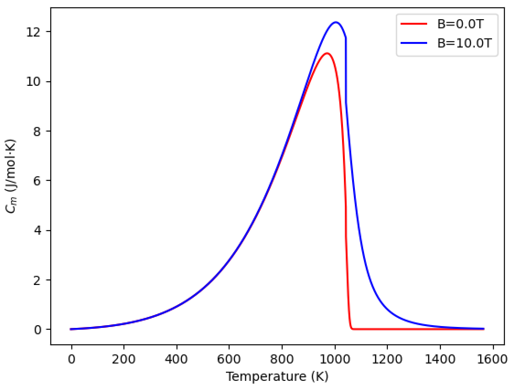
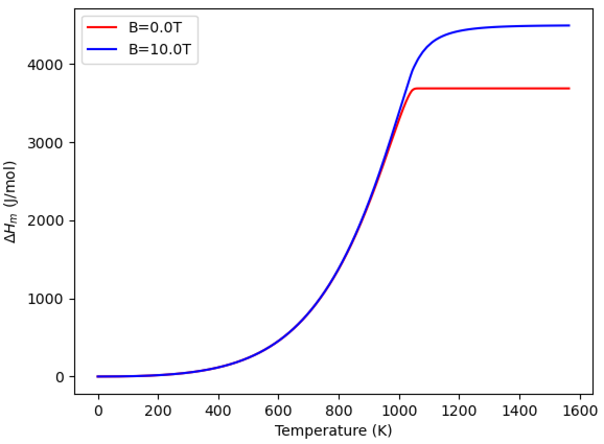
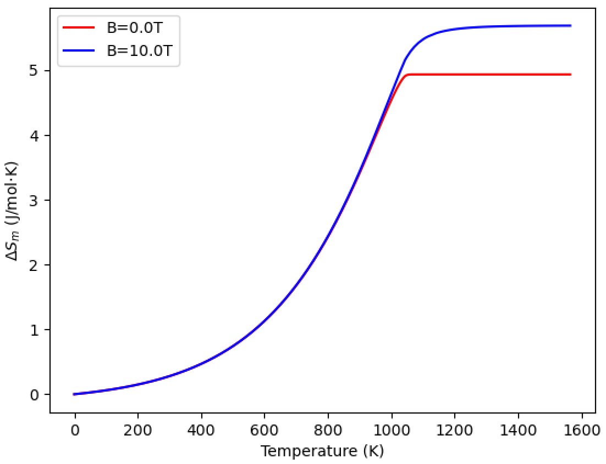

# Magntic Gibbs Free Energy based on Weiss Mean-Field Theory
Following the description in ["Z. Q. You, J. H. Zhen, T. P. Hou, D. Zhang, W. Zhou, H. F. Lin, Q. Isayev, S. Yershov, Y. Wu, and K. M. Wu, Thermodynamic mechanism of the magnetic-field-induced carbon content variation in bainitic ferrite during super bainite transformation, Journal of Magnetism and Magnetic Materials, 560, (2022) 169558."](https://doi.org/10.1016/j.jmmm.2022.169558)

## Requirements for Python
- Numpy
- Matplotlib

## Example for BCC Fe
Before calculation, you should see the contents of Weiss.py.
First in main() function, you will define input parameters ndiv, magfield, colors, Tc, nmag, struc for the system under consideration.

You can calculate the property by the following command.
```bash
python Weiss.py 2.2 -p
```
Here, 2.2 means the magnetic moment of Fe by DFT.
-p activates to plot results.

### Result figures
- Moment.pdf ... Magnetic moment vs temperature
<img width="300" src="figs/Moment.png")

- Cm.pdf ... Specific heat vs temperature


- dHm.pdf ... Entalphy vs temperature


- dSm.pdf ... Entropy vs temperature


- dGm.pdf ... Magnetic Gibbs free energy vs tempearture

