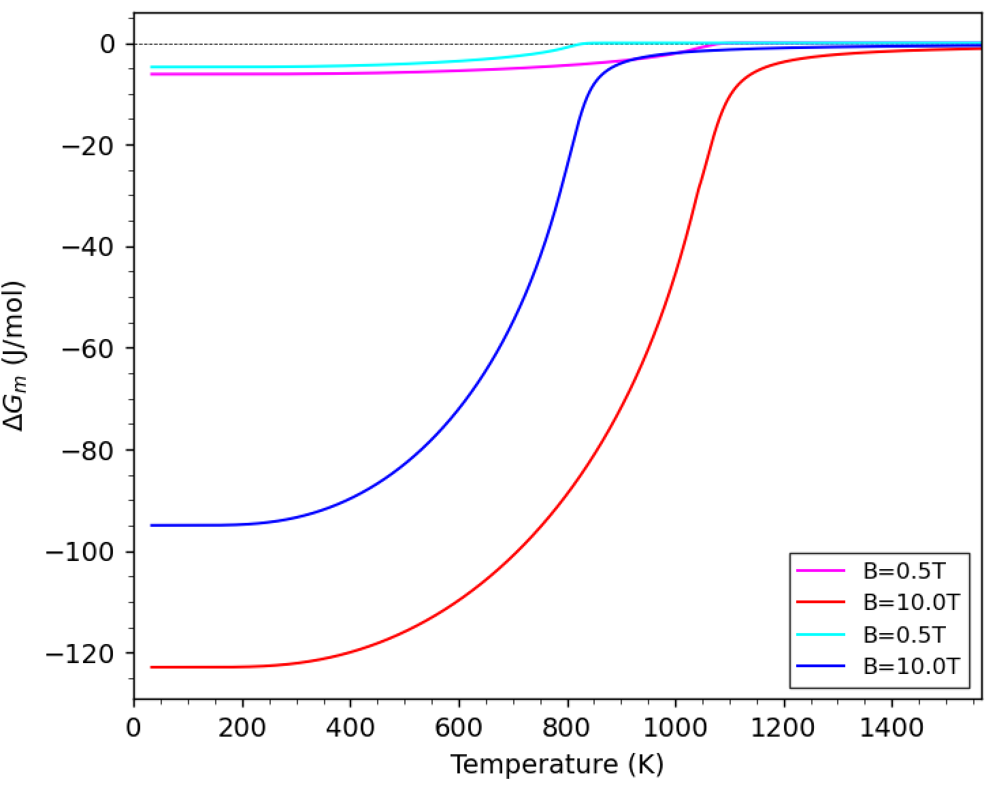

# Magntic Gibbs Free Energy based on Weiss Mean-Field Theory
Following the description in ["Z. Q. You, J. H. Zhen, T. P. Hou, D. Zhang, W. Zhou, H. F. Lin, Q. Isayev, S. Yershov, Y. Wu, and K. M. Wu, Thermodynamic mechanism of the magnetic-field-induced carbon content variation in bainitic ferrite during super bainite transformation, Journal of Magnetism and Magnetic Materials, 560, (2022) 169558."](https://doi.org/10.1016/j.jmmm.2022.169558)

## Requirements for Python
- Numpy
- Matplotlib
- Scipy

## Example for BCC Fe
Before calculation, you should see the contents of Weiss.py.  
In main() function, you will define input parameters ndiv, magfield, colors, Tc, nmag, struc for the system under consideration.

You should modify the parameters (m0, magfield, colors, Tc, nmag) in Weiss.py before calculations.
You can calculate the property by the following command.
```bash
python Weiss.py -p
```
Here, "-p" activates the plot option.

## Theory
The magnetization curve is calculated by the Weiss mean-field theory.
Therefore, the curve is simulated by Brillouin function. 

$$
\begin{align}
m(B,T) &= m_0 Br\left(J, \cfrac{m_0 (B+\lambda m(B,T))}{k_BT}\right)
\end{align}
$$

$$
\begin{align}
Br(J,x) &= \cfrac{2J+1}{2J} \coth{\left( \cfrac{2J+1}{2J}x \right)} - \cfrac{1}{2J} \coth{\left( \cfrac{1}{2J}x \right)}
\end{align}
$$

Here, $${\lambda}$$ stands for the molecular field constant given by the following equation.

$$
\begin{align}
\lambda = \cfrac{3k_BT_C}{J(J+1)g^2\mu_B^2}
\end{align}
$$

The magnetic Gibbs free energy will be given by the integration of the magnetization curve with respect to magnetic field as follows.

$$
\begin{align}
\Delta G_m(B,T) = -\int_0^B dB' m(B',T)
\end{align}
$$

### Result figures
- Moment.pdf ... Magnetic moment vs temperature


- dGm.pdf ... Magnetic Gibbs free energy vs tempearture

